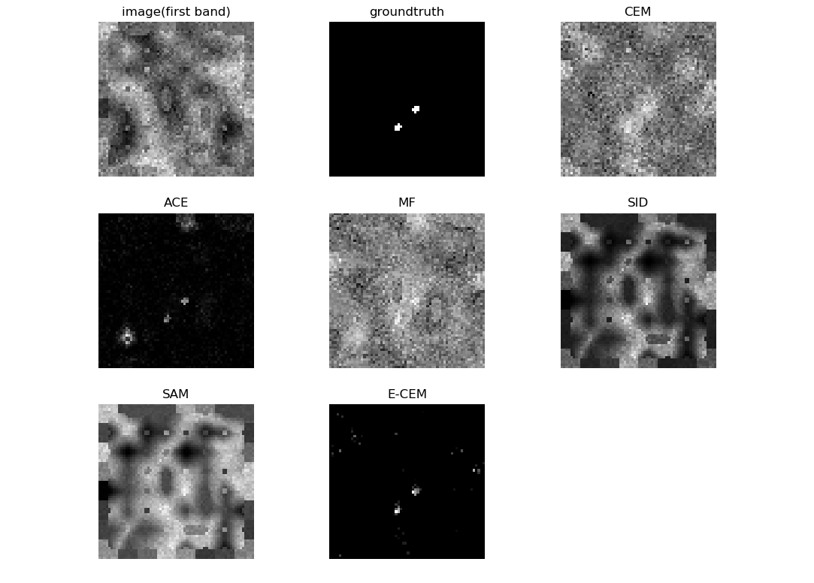
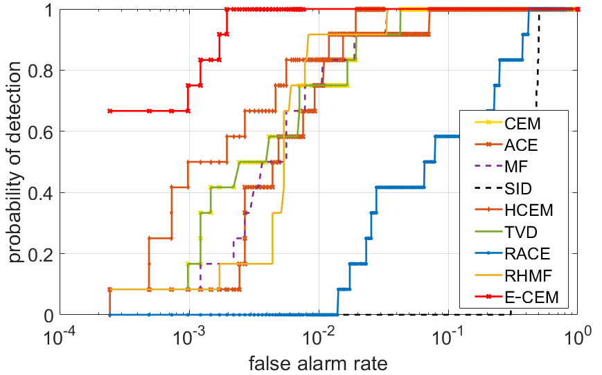
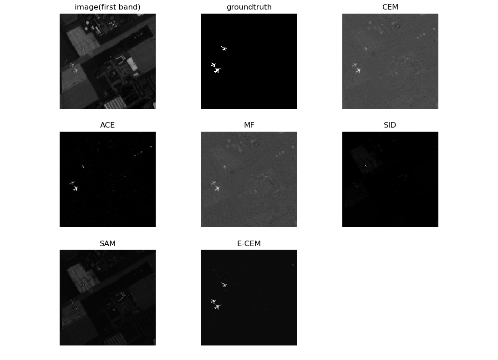
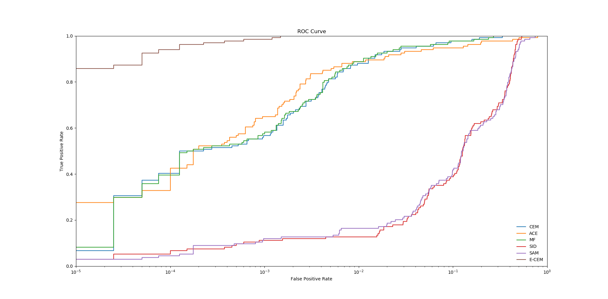
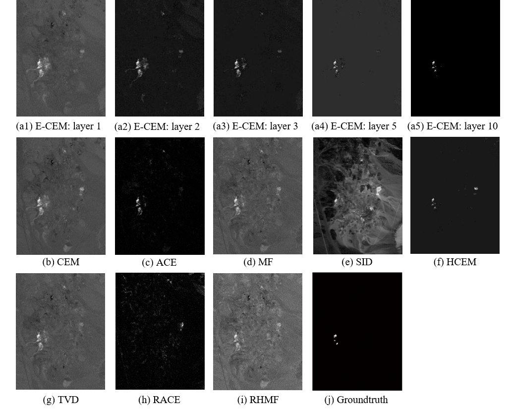
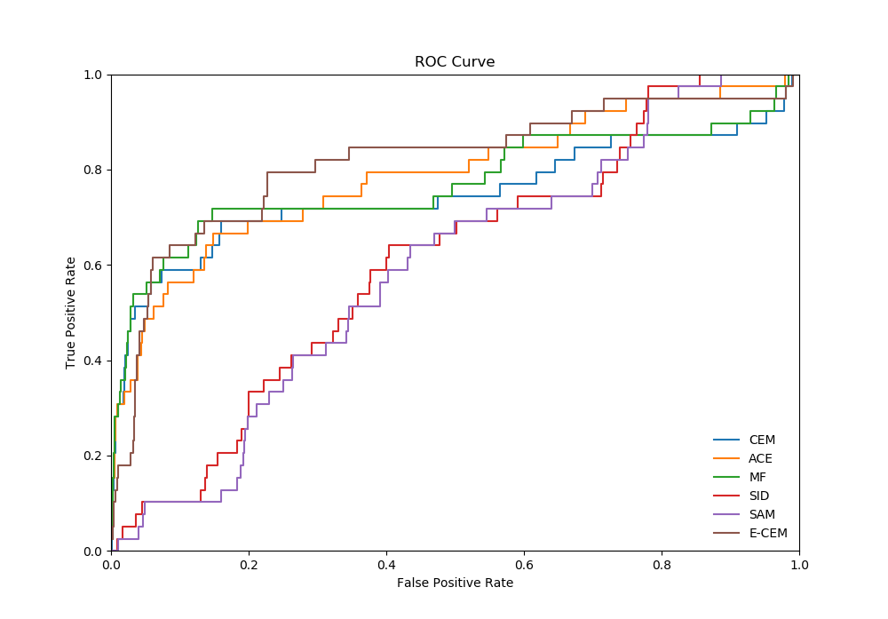

# E_CEM-for-Hyperspectral-Target-Detection
Python implementation for Ensemble-Based Cascaded Constrained Energy Minimization (E-CEM) algorithm.

For more information of this project, please refer to our paper: [R Zhao, Z Shi, Z Zou, Z Zhang, Ensemble-Based Cascaded Constrained Energy Minimization for Hyperspectral Target Detection. Remote Sensing 2019.](https://www.mdpi.com/472682)


## Prerequisites

- python 3.5
- anaconda>=4.6


## Files

- [demo.py](demo.py): Shows how to run the E-CEM detector.
- [exp.py](exp.py): Reproduces the experiments in the paper.
- [e-cem.py](e-cem.py): Implementation of the E-CEM detector.
- [detector_zoo.py](detector_zoo.py): Implementation of some classical detectors.
- [utils.py](utils.py): Some useful tools.
- [hyperspectral_data](hyperspectral_data.py): Data used in our experiments.

## Usage

To run the E-CEM detector:

```
python demo.py
```

To reproduce our experiments:

```
python exp.py 
```

## Citation

```
@article{zhao2019ensemble,
  title={Ensemble-Based Cascaded Constrained Energy Minimization for Hyperspectral Target Detection},
  author={Zhao, Rui and Shi, Zhenwei and Zou, Zhengxia and Zhang, Zhou},
  journal={Remote Sensing},
  volume={11},
  number={11},
  pages={1310},
  year={2019},
  publisher={Multidisciplinary Digital Publishing Institute}
}
```

## Overview

Ensemble learning is an important group of machine learning techniques that aim to enhance the nonlinearity and generalization ability of a learning system by aggregating multiple learners. We found that ensemble techniques show great potential for improving the performance of traditional hyperspectral target detection algorithms, while at present, there are few previous works have been done on this topic. To this end, we propose an Ensemble based Constrained Energy Minimization (E-CEM) detector for hyperspectral image target detection. Classical hyperspectral image target detection algorithms like Constrained Energy Minimization (CEM), matched filter (MF)
and adaptive coherence/cosine estimator (ACE) are usually designed based on constrained least square regression methods or hypothesis testing methods with Gaussian distribution assumption. However, remote sensing hyperspectral data captured in a real-world environment usually shows strong nonlinearity and non-Gaussianity, which will lead to performance degradation of these classical detection algorithms. Although some hierarchical detection models are able to learn strong nonlinear discrimination of spectral data, due to the spectrum changes, these models usually suffer from the instability in detection tasks. The proposed E-CEM is designed based on the classical CEM detection algorithm. To improve both of the detection nonlinearity and generalization ability, the strategies of “cascaded detection”, “random averaging” and “multi-scale scanning” are specifically designed. Experiments on one synthetic hyperspectral image and two real hyperspectral images demonstrate the effectiveness of our method. E-CEM outperforms the traditional CEM detector and other state-of-the-art detection algorithms.

E-CEM detector consists of two stages, (1) “multi-scale scanning” stage and (2) “cascaded detection” stage. In the first stage, the input is a spectral vector while the output is a feature vector containing multi-scale spectral information, which aims to extract the features of the spectrum and to enhance the robustness to spectrum changes. In the second stage, the input is the feature vector produced by the multi-scale scanning stage, while the output is the final detection score, where the higher the score, the more likely the current spectrum is a target. In this stage, we use a cascaded detection structure with sigmoid nonlinear transformation to enhance the nonlinear discrimination ability of the detector. Besides, we also use multiple CEM detectors in each layer to further improve
the robustness to spectral changes. Figure 1 shows an illustration of the E-CEM detector.

 **Figure 1.** An overview of the E-CEM detector. </div>


## Experiments

#### Detection Results on Synthetic Data

 **Figure 2.** The first band of the synthetic hyperspectral image (with noise
of 20dB SNR), ground truth location of the target and detection results. </div>

 **Figure 3.** ROC curves of different detection algorithms on our synthetic hyperspectral data (with noise
of 20dB SNR). </div>

#### Detection Results on AVIRIS San Diego Data

 **Figure 4.** The first band of the AVIRIS San Diego hyperspectral image, ground truth location of the target and detection results. </div>

 **Figure 5.** ROC curves of different detection algorithms on AVIRIS San Diego hyperspectral image. </div>

#### Detection Results on AVIRIS Cuprite Data

 **Figure 6.** The first band of the AVIRIS Cuprite hyperspectral image, ground truth location of the target and detection results. </div>

 **Figure 7.** ROC curves of different detection algorithms on AVIRIS Cuprite hyperspectral image. </div>

